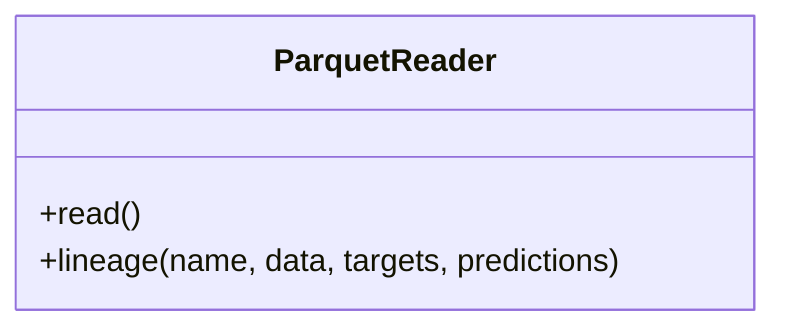

# ParquetReader

Source File: `src/autogen_team/data_access/adapters/datasets.py`

Read a dataframe from a parquet file.  Parameters:     path (str): local path to the dataset.

## Architecture Visualization

