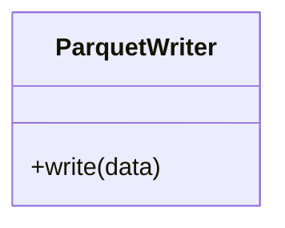

# ParquetWriter

Source File: `src/autogen_team/data_access/adapters/datasets.py`

Writer a dataframe to a parquet file.  Parameters:     path (str): local or S3 path to the dataset.

## Architecture Visualization

