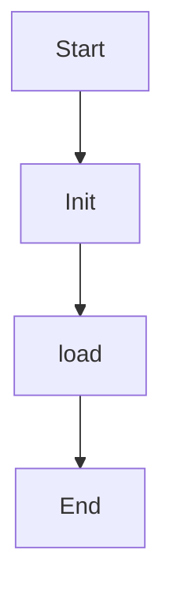

# parse_file

Source File: `src/autogen_team/infrastructure/io/configs.py`

Parse a config file from a path.  Args:     path (str): path to local config.  Returns:     Config: representation of the config file.

## Architecture Visualization

