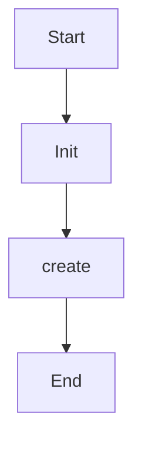

# parse_string

Source File: `src/autogen_team/infrastructure/io/configs.py`

Parse the given config string.  Args:     string (str): content of config string.  Returns:     Config: representation of the config string.

## Architecture Visualization

