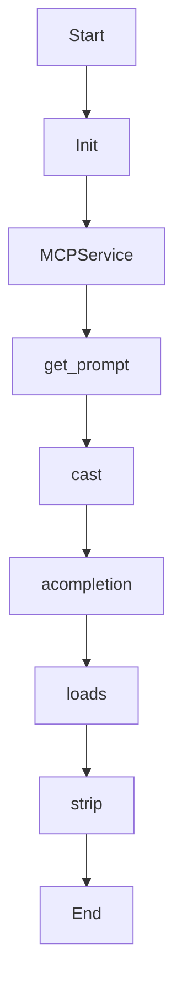

# plan_mission

Source File: `src/autogen_team/application/mcp/tools/plan_mission.py`

Decompose a high-level goal into a task DAG.  Args:     goal: A high-level goal string to decompose.  Returns:     A dict representing the task DAG with parallel_tasks array.

## Architecture Visualization

