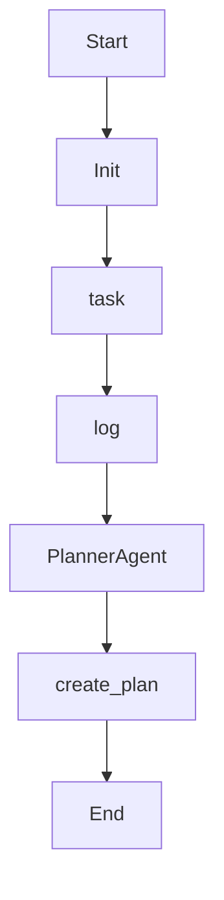

# plan

Source File: `src/autogen_team/application/workflows/autonomous_mission.py`

Step 1: Planner Agent analyses the goal and creates a task DAG.

## Architecture Visualization

```mermaid
flowchart TD
    Start --> Init
    Init --> call_0[task]
    call_0 --> call_1[log]
    call_1 --> call_2[PlannerAgent]
    call_2 --> call_3[create_plan]
    call_3 --> End
```
