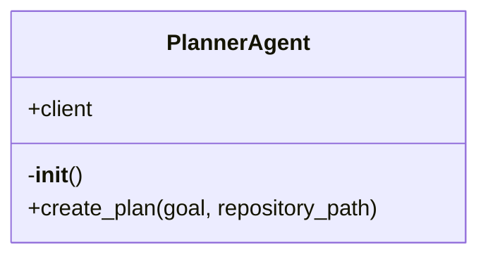

# PlannerAgent

Source File: `src/autogen_team/application/agents/planner_agent.py`

Agent responsible for decomposing a high-level goal into a detailed plan. Uses the MCP 'plan_mission' tool.

## Architecture Visualization

