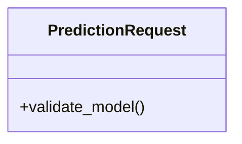

# PredictionRequest

Source File: `src/autogen_team/infrastructure/messaging/kafka_app.py`

Request model for prediction.

## Architecture Visualization

```mermaid
classDiagram
    class PredictionRequest {
        +validate_model()
    }
```
