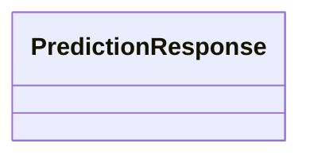

# PredictionResponse

Source File: `src/autogen_team/infrastructure/messaging/kafka_app.py`

Response model for prediction.

## Architecture Visualization

```mermaid
classDiagram
    class PredictionResponse {
    }
```
