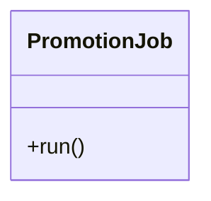

# PromotionJob

Source File: `src/autogen_team/application/jobs/promotion.py`

Define a job for promoting a registered model version with an alias.  https://mlflow.org/docs/latest/model-registry.html#concepts  Parameters:     alias (str): the mlflow alias to transition the registered model version.     version (int | None): the model version to transition (use None for latest).

## Architecture Visualization

