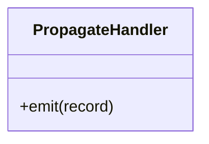

# PropagateHandler

Source File: `src/autogen_team/infrastructure/services/logger_service.py`

Concise functional summary.

## Architecture Visualization

```mermaid
classDiagram
    class PropagateHandler {
        +emit(record)
    }
```
