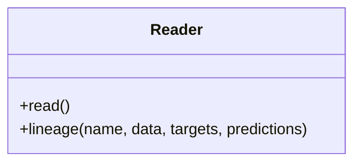

# Reader

Source File: `src/autogen_team/data_access/adapters/datasets.py`

Base class for a dataset reader.  Use a reader to load a dataset in memory. e.g., to read file, database, cloud storage, ...  Parameters:     limit (int, optional): maximum number of rows to read. Defaults to None.

## Architecture Visualization

