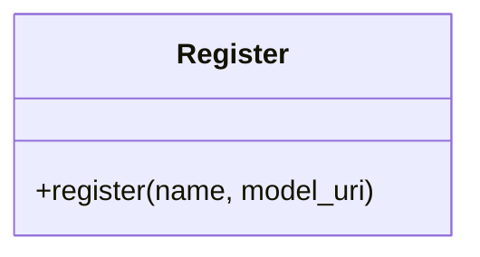

# Register

Source File: `src/autogen_team/registry/adapters/mlflow_adapter.py`

Base class for registring models to a location.  Separate model definition from its registration. e.g., to change the model registry backend.  Parameters:     tags (dict[str, T.Any]): tags for the model.

## Architecture Visualization

