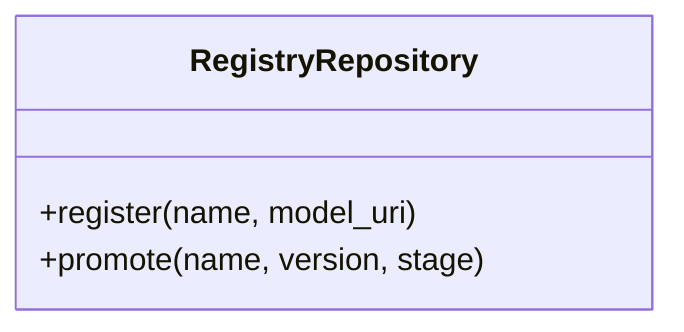

# RegistryRepository

Source File: `src/autogen_team/registry/repositories.py`

Abstract repository for model registry.

## Architecture Visualization

```mermaid
classDiagram
    class RegistryRepository {
        +register(name, model_uri)
        +promote(name, version, stage)
    }
```
