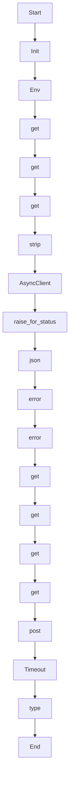

# retrieve_context

Source File: `src/autogen_team/application/mcp/tools/retrieve_context.py`

Query R2R RAG system for relevant codebase patterns via semantic search.  Args:     query: Search query string.     collection_name: Name of the R2R collection to search.  Returns:     Dict with matching documents and graph context.

## Architecture Visualization

