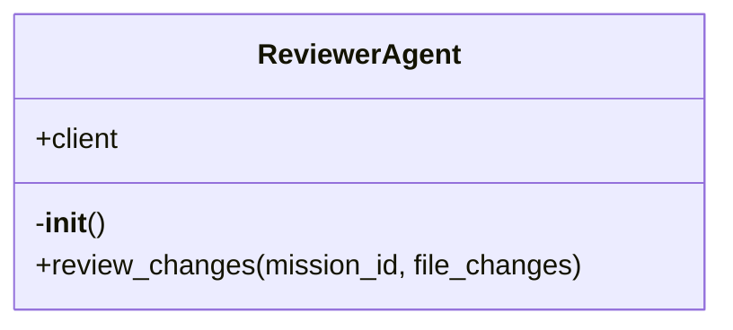

# ReviewerAgent

Source File: `src/autogen_team/application/agents/reviewer_agent.py`

Agent responsible for reviewing code changes. Uses the MCP 'security_review' tool.

## Architecture Visualization

