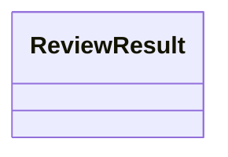

# ReviewResult

Source File: `src/autogen_team/infrastructure/messaging/a2a_protocol.py`

Result from a Reviewer Agent.

## Architecture Visualization

```mermaid
classDiagram
    class ReviewResult {
    }
```
