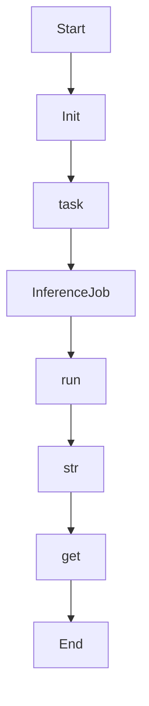

# run_inference

Source File: `src/autogen_team/infrastructure/orchestration/hatchet_workflows.py`

Run the inference job.

## Architecture Visualization

```mermaid
flowchart TD
    Start --> Init
    Init --> call_0[task]
    call_0 --> call_1[InferenceJob]
    call_1 --> call_2[run]
    call_2 --> call_3[str]
    call_3 --> call_4[get]
    call_4 --> End
```
