# run_tests

Source File: `src/autogen_team/application/mcp/tools/run_tests.py`

Run pytest against code changes in an isolated sandbox.  Args:     changes: Dict with files_changed list (path, action, content).     workspace_path: Original workspace path to copy from.     timeout: Max execution time in seconds.     sandbox: Optional sandbox backend (defaults to SubprocessSandbox).  Returns:     Dict with passed bool, summary string, and details.

## Architecture Visualization

```mermaid
flowchart TD
    Start --> Init
    Init --> call_0[get]
    call_0 --> call_1[mkdtemp]
    call_1 --> call_2[cast]
    call_2 --> call_3[rmtree]
    call_3 --> call_4[isdir]
    call_4 --> call_5[copytree]
    call_5 --> call_6[run_tests]
    call_6 --> call_7[isabs]
    call_7 --> call_8[startswith]
    call_8 --> call_9[safe_join]
    call_9 --> call_10[safe_join]
    call_10 --> call_11[get]
    call_11 --> call_12[get]
    call_12 --> call_13[get]
    call_13 --> call_14[getcwd]
    call_14 --> call_15[safe_join]
    call_15 --> call_16[makedirs]
    call_16 --> call_17[exists]
    call_17 --> call_18[dirname]
    call_18 --> call_19[open]
    call_19 --> call_20[write]
    call_20 --> call_21[remove]
    call_21 --> End
```

