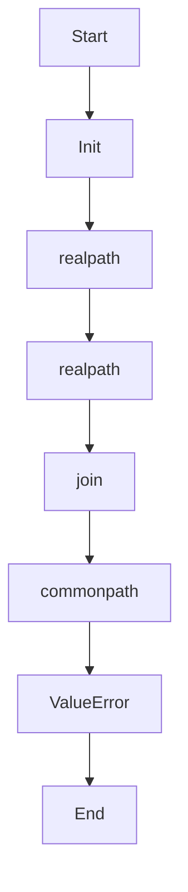

# safe_join

Source File: `src/autogen_team/core/security.py`

Safely join paths, ensuring the result is within the base directory.  Args:     base (str): The base directory.     *paths (str): Paths to join.  Returns:     str: The joined path.  Raises:     ValueError: If the resolved path is outside the base directory.

## Architecture Visualization

