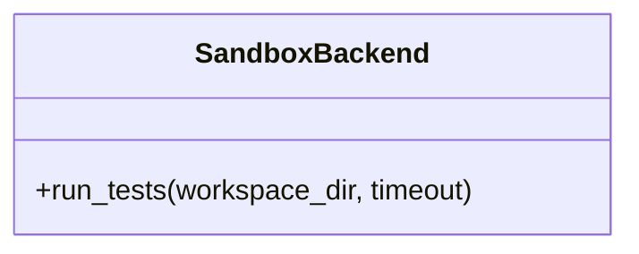

# SandboxBackend

Source File: `src/autogen_team/application/mcp/tools/run_tests.py`

Abstract sandbox backend for running tests.  Provides an interface for future Firecracker MicroVM integration.

## Architecture Visualization

