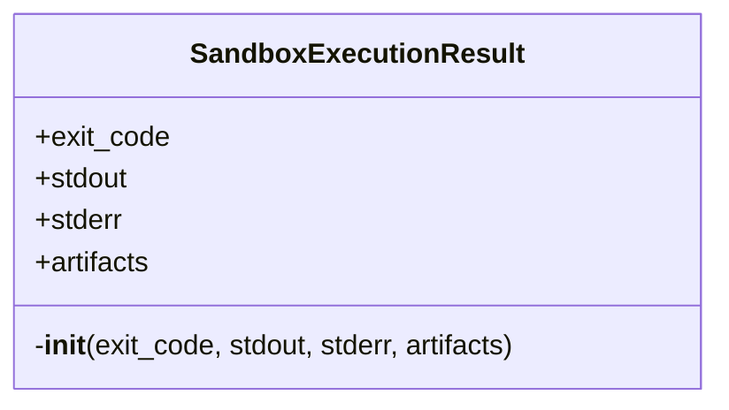

# SandboxExecutionResult

Source File: `src/autogen_team/infrastructure/services/sandbox_service.py`

Result of a command execution inside the sandbox.

## Architecture Visualization

```mermaid
classDiagram
    class SandboxExecutionResult {
        +exit_code
        +stdout
        +stderr
        +artifacts
        -__init__(exit_code, stdout, stderr, artifacts)
    }
```
