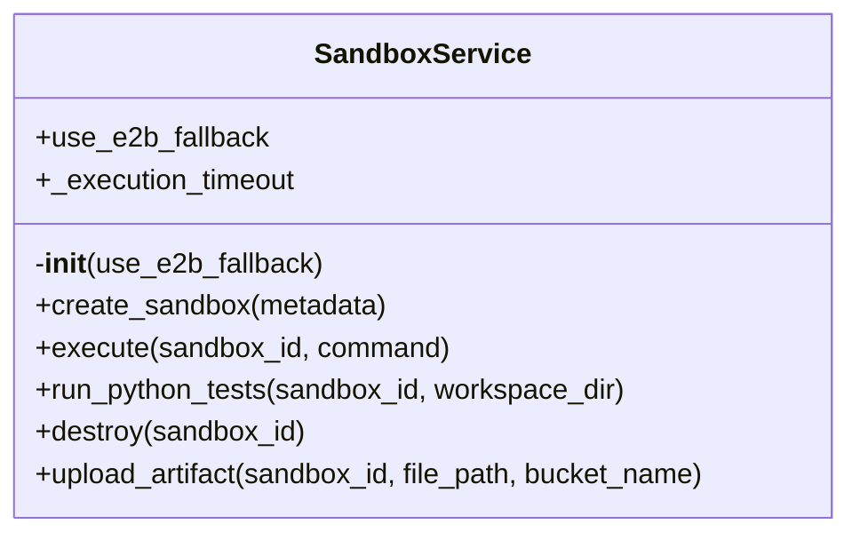

# SandboxService

Source File: `src/autogen_team/infrastructure/services/sandbox_service.py`

Manages ephemeral MicroVM sandboxes for secure code execution.

## Architecture Visualization

```mermaid
classDiagram
    class SandboxService {
        +use_e2b_fallback
        +_execution_timeout
        -__init__(use_e2b_fallback)
        +create_sandbox(metadata)
        +execute(sandbox_id, command)
        +run_python_tests(sandbox_id, workspace_dir)
        +destroy(sandbox_id)
        +upload_artifact(sandbox_id, file_path, bucket_name)
    }
```
