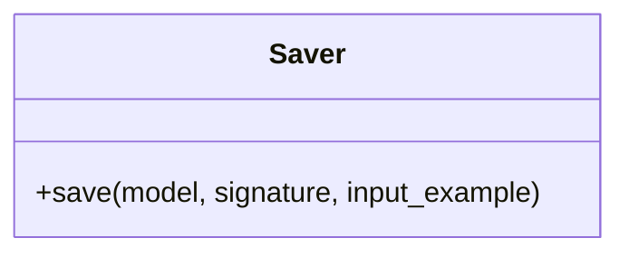

# Saver

Source File: `src/autogen_team/registry/adapters/mlflow_adapter.py`

Base class for saving models in registry.  Separate model definition from serialization. e.g., to switch between serialization flavors.  Parameters:     path (str): model path inside the Mlflow store.

## Architecture Visualization

