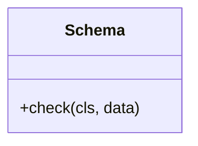

# Schema

Source File: `src/autogen_team/core/schemas.py`

Base class for a dataframe schema.  Use a schema to type your dataframe object. e.g., to communicate and validate its fields.

## Architecture Visualization

