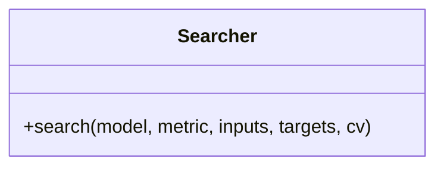

# Searcher

Source File: `src/autogen_team/infrastructure/utils/searchers.py`

Base class for a searcher.  Use searcher to fine-tune models. i.e., to find the best model params.  Parameters:     param_grid (Grid): mapping of param key -> values.

## Architecture Visualization

