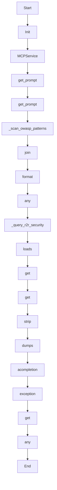

# security_review

Source File: `src/autogen_team/application/mcp/tools/security_review.py`

Analyze code diffs against OWASP patterns and R2R RAG security knowledge.  Args:     diff: The code diff string to review.  Returns:     Dict with status (approved/rejected) and findings list.

## Architecture Visualization

