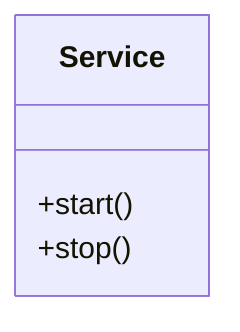

# Service

Source File: `src/autogen_team/infrastructure/services/logger_service.py`

Base class for a global service.

## Architecture Visualization

```mermaid
classDiagram
    class Service {
        +start()
        +stop()
    }
```
