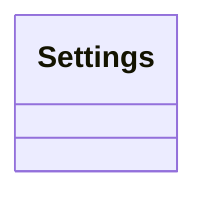

# Settings

Source File: `src/autogen_team/settings.py`

Base class for application settings.  Use settings to provide high-level preferences. i.e., to separate settings from provider (e.g., CLI).

## Architecture Visualization

