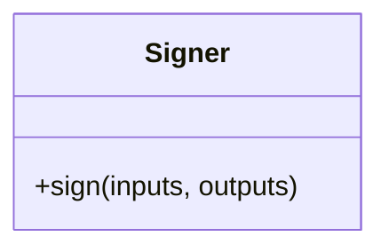

# Signer

Source File: `src/autogen_team/infrastructure/utils/signers.py`

Base class for generating model signatures.  Allow to switch between model signing strategies. e.g., automatic inference, manual model signature, ...  https://mlflow.org/docs/latest/models.html#model-signature-and-input-example

## Architecture Visualization

