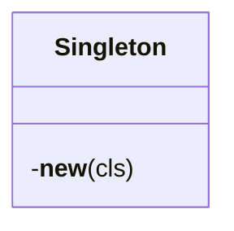

# Singleton

Source File: `src/autogen_team/infrastructure/io/osvariables.py`

Concise functional summary.

## Architecture Visualization

```mermaid
classDiagram
    class Singleton {
        -__new__(cls)
    }
```
