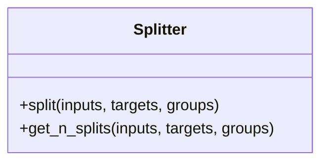

# Splitter

Source File: `src/autogen_team/infrastructure/utils/splitters.py`

Base class for a splitter.  Use splitters to split data in sets. e.g., split between a train/test subsets.  # https://scikit-learn.org/stable/glossary.html#term-CV-splitter

## Architecture Visualization

