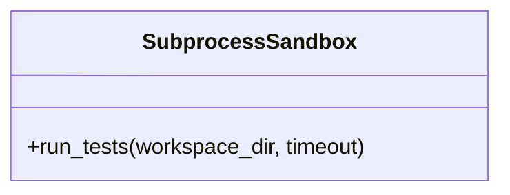

# SubprocessSandbox

Source File: `src/autogen_team/application/mcp/tools/run_tests.py`

Subprocess-based sandbox for running pytest.

## Architecture Visualization

```mermaid
classDiagram
    class SubprocessSandbox {
        +run_tests(workspace_dir, timeout)
    }
```
