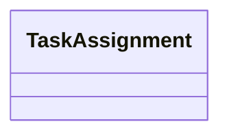

# TaskAssignment

Source File: `src/autogen_team/infrastructure/messaging/a2a_protocol.py`

Payload for assigning a task to a Coder Agent.

## Architecture Visualization

```mermaid
classDiagram
    class TaskAssignment {
    }
```
