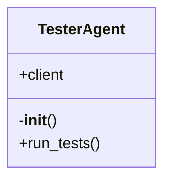

# TesterAgent

Source File: `src/autogen_team/application/agents/tester_agent.py`

Agent responsible for running tests. Uses the MCP 'run_tests' tool.

## Architecture Visualization

```mermaid
classDiagram
    class TesterAgent {
        +client
        -__init__()
        +run_tests()
    }
```
