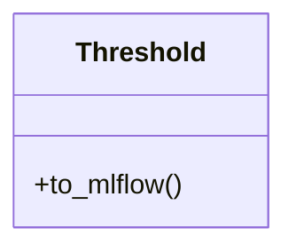

# Threshold

Source File: `src/autogen_team/evaluation/metrics/metrics.py`

A project threshold for a metric.  Use thresholds to monitor model performances. e.g., to trigger an alert when a threshold is met.  Parameters:     threshold (int | float): absolute threshold value.     greater_is_better (bool): maximize or minimize result.

## Architecture Visualization

