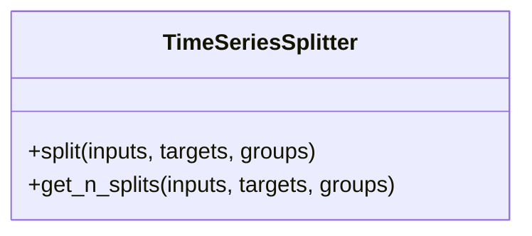

# TimeSeriesSplitter

Source File: `src/autogen_team/infrastructure/utils/splitters.py`

Split a dataframe into fixed time series subsets.  Parameters:     gap (int): gap between splits.     n_splits (int): number of split to generate.     test_size (int | float): number or ratio for the test dataset.

## Architecture Visualization

