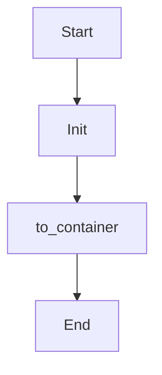

# to_object

Source File: `src/autogen_team/infrastructure/io/configs.py`

Convert a config object to a python object.  Args:     config (Config): representation of the config.     resolve (bool): resolve variables. Defaults to True.  Returns:     object: conversion of the config to a python object.

## Architecture Visualization

