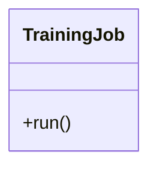

# TrainingJob

Source File: `src/autogen_team/application/jobs/training.py`

Train and register a single AI/ML model.  Parameters:     run_config (services.MlflowService.RunConfig): mlflow run config.     inputs (datasets.ReaderKind): reader for the inputs data.     targets (datasets.ReaderKind): reader for the targets data.     model (models.ModelKind): machine learning model to train.     metrics (metrics_.MetricKind): metrics for the reporting.     splitter (splitters.SplitterKind): data sets splitter.     saver (registries.SaverKind): model saver.     signer (signers.SignerKind): model signer.     registry (registries.RegisterKind): model register.

## Architecture Visualization

