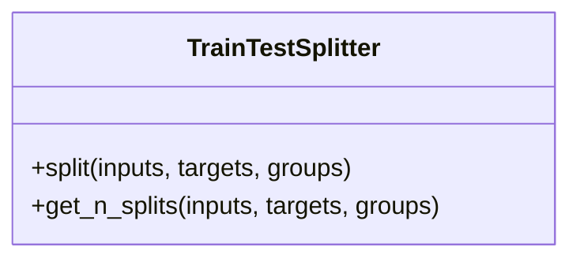

# TrainTestSplitter

Source File: `src/autogen_team/infrastructure/utils/splitters.py`

Split a dataframe into a train and test set.  Parameters:     shuffle (bool): shuffle the dataset. Default is False.     test_size (int | float): number/ratio for the test set.     random_state (int): random state for the splitter object.

## Architecture Visualization

