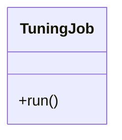

# TuningJob

Source File: `src/autogen_team/application/jobs/tuning.py`

Find the best hyperparameters for a model. https://microsoft.github.io/FLAML/docs/Examples/AutoGen-OpenAI/ https://github.com/microsoft/FLAML/blob/main/notebook/autogen_openai_completion.ipynb  Parameters:     run_config (services.MlflowService.RunConfig): mlflow run config.     inputs (datasets.ReaderKind): reader for the inputs data.     targets (datasets.ReaderKind): reader for the targets data.     model (models.ModelKind): machine learning model to tune.     metric (metrics.MetricKind): tuning metric to optimize.     splitter (splitters.SplitterKind): data sets splitter.     searcher: (searchers.SearcherKind): hparams searcher.

## Architecture Visualization

