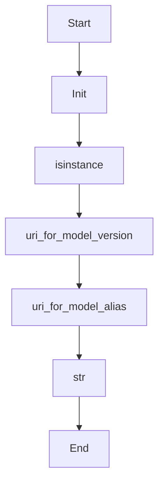

# uri_for_model_alias_or_version

Source File: `src/autogen_team/registry/adapters/mlflow_adapter.py`

Create a model URi from a model name and an alias or version.  Args:     name (str): name of the mlflow registered model.     alias_or_version (str | int): alias or version of the registered model.  Returns:     str: model URI as "models:/name@alias" or "models:/name/version" based on input.

## Architecture Visualization

