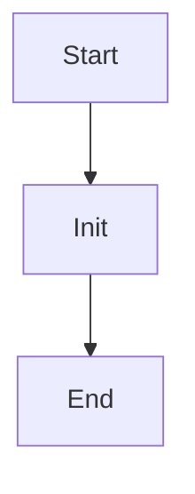

# uri_for_model_alias

Source File: `src/autogen_team/registry/adapters/mlflow_adapter.py`

Create a model URI from a model name and an alias.  Args:     name (str): name of the mlflow registered model.     alias (str): alias of the registered model.  Returns:     str: model URI as "models:/name@alias".

## Architecture Visualization

