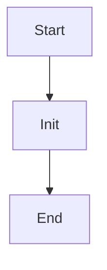

# uri_for_model_version

Source File: `src/autogen_team/registry/adapters/mlflow_adapter.py`

Create a model URI from a model name and a version.  Args:     name (str): name of the mlflow registered model.     version (int): version of the registered model.  Returns:     str: model URI as "models:/name/version."

## Architecture Visualization

