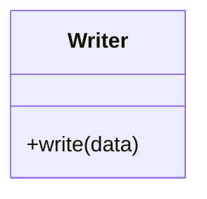

# Writer

Source File: `src/autogen_team/data_access/adapters/datasets.py`

Base class for a dataset writer.  Use a writer to save a dataset from memory. e.g., to write file, database, cloud storage, ...

## Architecture Visualization

