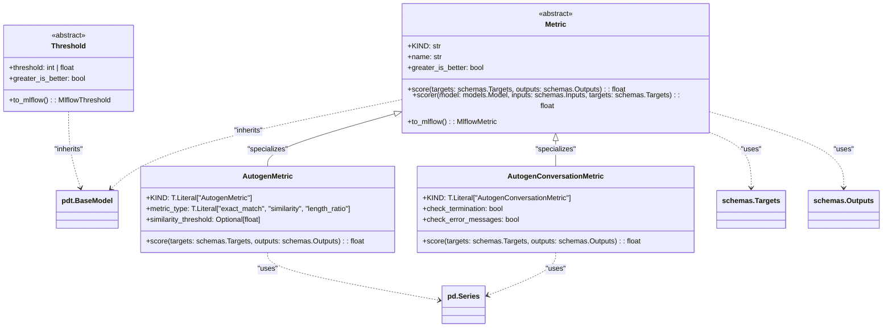

# US [Model Performance Evaluation](./backlog_mlops_performance.md) : Evaluate model performances using various metrics and thresholds.

- [US Model Performance Evaluation : Evaluate model performances using various metrics and thresholds.](#us-model-performance-evaluation--evaluate-model-performances-using-various-metrics-and-thresholds)
  - [classes relations](#classes-relations)
  - [**User Stories: Metric Evaluation**](#user-stories-metric-evaluation)
    - [**1. User Story: Evaluate Model Performance Using Metrics**](#1-user-story-evaluate-model-performance-using-metrics)
    - [**2. User Story: Convert Metrics to MLflow Format**](#2-user-story-convert-metrics-to-mlflow-format)
    - [**Common Acceptance Criteria**](#common-acceptance-criteria)
    - [**Definition of Done (DoD):**](#definition-of-done-dod)
  - [**User Stories: Autogen Metric Implementation**](#user-stories-autogen-metric-implementation)
    - [**1. User Story: Evaluate Text-Based Responses**](#1-user-story-evaluate-text-based-responses)
    - [**2. User Story: Calculate Similarity Score for Responses**](#2-user-story-calculate-similarity-score-for-responses)
    - [**Common Acceptance Criteria**](#common-acceptance-criteria-1)
    - [**Definition of Done (DoD):**](#definition-of-done-dod-1)
  - [**User Stories: Conversation Metrics Implementation**](#user-stories-conversation-metrics-implementation)
    - [**1. User Story: Assess Conversation Quality**](#1-user-story-assess-conversation-quality)
    - [**Common Acceptance Criteria**](#common-acceptance-criteria-2)
    - [**Definition of Done (DoD):**](#definition-of-done-dod-2)
  - [Code location](#code-location)
  - [Test location](#test-location)

------------

## classes relations

## **User Stories: Metric Evaluation**

---

### **1. User Story: Evaluate Model Performance Using Metrics**

**Title:**  
As a **data analyst**, I want to evaluate the performance of machine learning models using various metrics to determine their effectiveness.

**Description:**  
The `Metric` base class provides a standardized way to implement various performance evaluation metrics (e.g., accuracy, recall). This system allows for accurate model performance assessment.

**Acceptance Criteria:**  
- The `score` method calculates the performance score based on targets and outputs.
- The system supports various metrics such as accuracy, precision, etc.
- Implementations must override the `score` method to provide specific scoring logic.

---

### **2. User Story: Convert Metrics to MLflow Format**

**Title:**  
As a **machine learning engineer**, I want to convert model evaluation metrics to an MLflow-compatible format to facilitate tracking and visualization of performance metrics.

**Description:**  
The `to_mlflow` method in `Metric` allows for the automatic conversion of scoring results into a format compatible with MLflow, enabling easier integration into the MLflow tracking system.

**Acceptance Criteria:**  
- The `to_mlflow` method must return a valid MLflow metric.
- The conversion should correctly indicate whether higher metric values are better or worse, based on the `greater_is_better` attribute.

---

### **Common Acceptance Criteria**

1. **Implementation Requirements:**
   - The `Metric` class is abstract and cannot be instantiated directly.
   - Subclasses must implement the `score` method.

2. **Error Handling:**
   - If the `score` method is not implemented in a subclass, an appropriate error is raised.

3. **Testing:**
   - Unit tests validate correct metric calculations and conversions to MLflow metrics.

4. **Documentation:**
   - Clear documentation is provided for the `score` and `to_mlflow` methods, including examples.

---

### **Definition of Done (DoD):**

- The `Metric` class and associated methods are fully implemented, documented, and tested.
- The conversion method successfully produces the correct format for MLflow.
- Code passes peer review with adherence to established coding standards.

## **User Stories: Autogen Metric Implementation**

---

### **1. User Story: Evaluate Text-Based Responses**

**Title:**  
As a **data scientist**, I want to evaluate the text responses generated by the model using an autogen metric to ensure the quality of the model's output.

**Description:**  
The `AutogenMetric` class allows for scoring text-based outputs using different evaluation types (exact match, similarity). This enables a quantitative approach for assessing how well the model generates desired responses.

**Acceptance Criteria:**  
- The `score` method can compute scores for exact matches, similarity, or length ratios.
- The metric type must be set correctly before scoring.

---

### **2. User Story: Calculate Similarity Score for Responses**

**Title:**  
As a **data engineer**, I want to calculate the similarity between generated and target text responses to understand how closely the outputs resemble the expected results.

**Description:**  
The `similarity` metric type within `AutogenMetric` utilizes a scoring mechanism based on the SequenceMatcher to gauge text similarity.

**Acceptance Criteria:**  
- The similarity score calculation must use the `SequenceMatcher` class.
- Responses must be processed as strings prior to scoring.

---

### **Common Acceptance Criteria**

1. **Implementation Requirements:**
   - The `AutogenMetric` class properly inherits from the `Metric` class.
   - All metrics are clearly defined with appropriate parameters.

2. **Error Handling:**
   - The implementation must handle unknown metric types gracefully.

3. **Testing:**
   - Unit tests cover various input scenarios for text-based scoring.

4. **Documentation:**
   - Each method contains clear docstrings explaining the logic and expected input/output.

---

### **Definition of Done (DoD):**

- The `AutogenMetric` class is implemented with valid scoring methods.
- Code and unit tests pass, demonstrating correct functionality for various inputs.
- Documentation and examples are clear for end users.

## **User Stories: Conversation Metrics Implementation**

---

### **1. User Story: Assess Conversation Quality**

**Title:**  
As a **machine learning specialist**, I want to evaluate the quality of conversations produced by the model to ensure satisfactory interactions.

**Description:**  
The `AutogenConversationMetric` class enables assessment of conversation quality based on specified conditions, such as termination and the presence of errors.

**Acceptance Criteria:**  
- The `score` method must check both termination status and error messages.
- The metrics should provide a score representing the conversation quality.

---

### **Common Acceptance Criteria**

1. **Implementation Requirements:**
   - The `AutogenConversationMetric` class must accurately inherit from `Metric`.
   - Attributes for checking termination and error messages need to be implemented.

2. **Error Handling:**
   - Robust handling of any missing or malformed metadata.

3. **Testing:**
   - Unit tests validate scoring under different conversation circumstances.

4. **Documentation:**
   - Document all public methods and important parameters.

---

### **Definition of Done (DoD):**

- The `AutogenConversationMetric` is fully implemented and tested.
- Scoring based on quality metrics is verified.
- Documentation is available and easy to follow for usage and understanding.

## Code location

[src/model_name/core/metrics.py](../src/model_name/core/metrics.py)

## Test location

[tests/core/test_metrics.py](../tests/core/test_metrics.py)