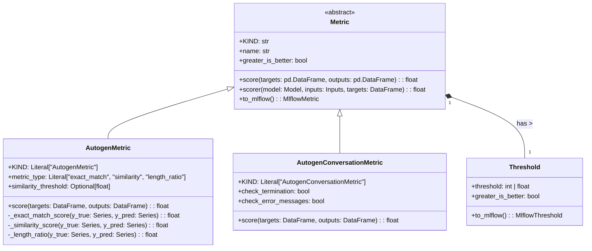

# US [Model Performance Evaluation](./backlog_llmlops_performance.md) : Evaluate model performances using various metrics and thresholds.

- [US Model Performance Evaluation : Evaluate model performances using various metrics and thresholds.](#us-model-performance-evaluation--evaluate-model-performances-using-various-metrics-and-thresholds)
  - [classes relations](#classes-relations)
  - [**User Stories: Model Evaluation**](#user-stories-model-evaluation)
    - [**1. User Story: Standardize Metric Definition**](#1-user-story-standardize-metric-definition)
    - [**2. User Story: Evaluate Model Performance with Base Metrics**](#2-user-story-evaluate-model-performance-with-base-metrics)
    - [**3. User Story: Evaluate Autogen Specific Metrics**](#3-user-story-evaluate-autogen-specific-metrics)
    - [**4. User Story: Exact Match Evaluation**](#4-user-story-exact-match-evaluation)
    - [**5. User Story: Similarity Score Evaluation**](#5-user-story-similarity-score-evaluation)
    - [**6. User Story: Length Ratio Evaluation**](#6-user-story-length-ratio-evaluation)
    - [**7. User Story: Evaluate Conversation Quality**](#7-user-story-evaluate-conversation-quality)
    - [**8. User Story: Define Performance Thresholds**](#8-user-story-define-performance-thresholds)
    - [**9. User Story: Convert Threshold to MLflow Format**](#9-user-story-convert-threshold-to-mlflow-format)
    - [**10. User Story: Integrate Metrics with MLflow**](#10-user-story-integrate-metrics-with-mlflow)
    - [**Common Acceptance Criteria**](#common-acceptance-criteria)
    - [**Definition of Done (DoD):**](#definition-of-done-dod)
  - [Code location](#code-location)
  - [Test location](#test-location)

------------

## classes relations

## **User Stories: Model Evaluation**

---

### **1. User Story: Standardize Metric Definition**

**Title:**
As a **data scientist**, I want a **base `Metric` class** that defines a standardized interface for evaluating model performance, so that I can easily create and use different metrics across my projects.

**Description:**
The `Metric` class establishes a consistent structure for defining and calculating evaluation metrics. This standardization allows for easier integration of new metrics and promotes reusability across different models and datasets.

**Acceptance Criteria:**
- The `Metric` class must be an abstract base class (`abc.ABC`).
- The `KIND` attribute should identify the specific type of metric.
- The class includes `name` (string) and `greater_is_better` (boolean) attributes.
- The `score` method is abstract and must be implemented by subclasses.
- The `scorer` method calculates the metric given a model, inputs, and targets.
- The `to_mlflow` method converts the metric to a format compatible with MLflow.

---

### **2. User Story: Evaluate Model Performance with Base Metrics**

**Title:**
As a **data scientist**, I want to evaluate model performance using base metrics like F1 score and accuracy through a unified method, so that I can consistently assess the model’s effectiveness.

**Description:**
The `Metric` base class defines an abstract method called `score` that child classes need to implement.

**Acceptance Criteria:**
- Be able to call `score` method on every metric object.
- Return an float that represent the score.

---

### **3. User Story: Evaluate Autogen Specific Metrics**

**Title:**
As a **data scientist**, I want to evaluate performance using Autogen-specific metrics, including exact match, similarity, and length ratio, so that I can evaluate text based responses .

**Description:**
The `AutogenMetric` class enables calculating metrics specific to text generation models. It handles response comparison based on exact match, similarity, or length ratio.

**Acceptance Criteria:**
- Should return a similarity score.
- Should return length ratio.
- Should return a exact match score.

---

### **4. User Story: Exact Match Evaluation**

**Title:**
As a **data scientist**, I want a metric that evaluates the exact correspondence of textual outputs, so that I can quickly determine perfect matches for text-based responses.

**Description:**
The `_exact_match_score` function inside `AutogenMetric` provides a method for scoring exact matches between target and output texts.

**Acceptance Criteria:**
- Returns 1.0 when the output text exactly matches the target text.
- Returns 0.0 when there is any difference between the texts.

---

### **5. User Story: Similarity Score Evaluation**

**Title:**
As a **data scientist**, I want a metric that evaluates the similarity between the generated output and target responses.

**Description:**
The `_similarity_score` function calculates a similarity score between the generated output and the target using `SequenceMatcher`.

**Acceptance Criteria:**
- Should return the mean value.
- Values should be calculated between the text strings.

---

### **6. User Story: Length Ratio Evaluation**

**Title:**
As a **data scientist**, I want a metric that evaluates the appropriateness of response length for text, so that I can penalize too short or too verbose answers.

**Description:**
The `_length_ratio` function calculates the ratio between the length of the predicted and target responses.

**Acceptance Criteria:**
- Should return the realation between the strings.

---

### **7. User Story: Evaluate Conversation Quality**

**Title:**
As a **data scientist**, I want to evaluate the quality of conversations to measure how effective the flow went .

**Description:**
The `AutogenConversationMetric` class allows for checking if a conversation reached a termination and if any error messages occurred during the process.

**Acceptance Criteria:**
- Must check the terination is reached and the check termination is True.
- Must check has messages and the check messages is True.

---

### **8. User Story: Define Performance Thresholds**

**Title:**
As a **machine learning engineer**, I want to define performance thresholds for metrics so that I can receive alerts when model performance falls outside acceptable limits.

**Description:**
The `Threshold` class is used to define threshold values and to ensure that if is greather or lower of them.

**Acceptance Criteria:**
- Class have to return value greather than the threshold when `greather_is_better` property is `True`
- Class have to return value lower than the threshold when `greather_is_better` property is `False`

---

### **9. User Story: Convert Threshold to MLflow Format**

**Title:**
As a **machine learning platform engineer**, I want to be able to convert defined threshold to MLFlow format so that monitoring and alerting functions can understand them.

**Description:**
The to_mlflow method converts the threshold to an MLflow-compatible format.

**Acceptance Criteria:**
- It must be an object of type `MlflowThreshold`
- The `threshold` has to be the same as the source `threshold`
- The `greater_is_better` property has to be the same as the source.

---

### **10. User Story: Integrate Metrics with MLflow**

**Title:**
As a **MLOps Engineer**, I want to enable integration with MLflow, so that all metrics are logged automatically.

**Description:**
Each metric has a to_mlflow method and allow integration with MLFlow objects.

**Acceptance Criteria:**
- Check that the to_mlflow method exists.
- Check that all attributes are passed to MLFlow properly.

---

### **Common Acceptance Criteria**

1. **Implementation Requirements:**
   - All classes are correctly implemented with required abstract methods overridden.
   - Proper inheritance is used to share functionality and maintain consistency.
   - Pydantic is used for validation of class attributes.

2. **Error Handling:**
   - Custom exceptions are raised for specific issues, like unsupported metric types or invalid input data.

3. **Testing:**
   - Implement unit tests to validate correct metrics calculations and handling of edge cases.
   - Create integration tests to check interaction with MLflow.

4. **Documentation:**
   - Detailed documentation is provided for each class and method, including examples.
   - Include links to relevant external resources like the MLflow documentation.

---

### **Definition of Done (DoD):**

- All user stories are implemented and verified.
- Unit tests provide a high level of code coverage.
- Documentation is comprehensive and provides clear usage instructions.
- The code adheres to established coding standards and passes all CI/CD checks.

## Code location

[src/autogen_team/core/metrics.py](../src/autogen_team/core/metrics.py)

## Test location

[tests/core/test_metrics.py](../tests/core/test_metrics.py)