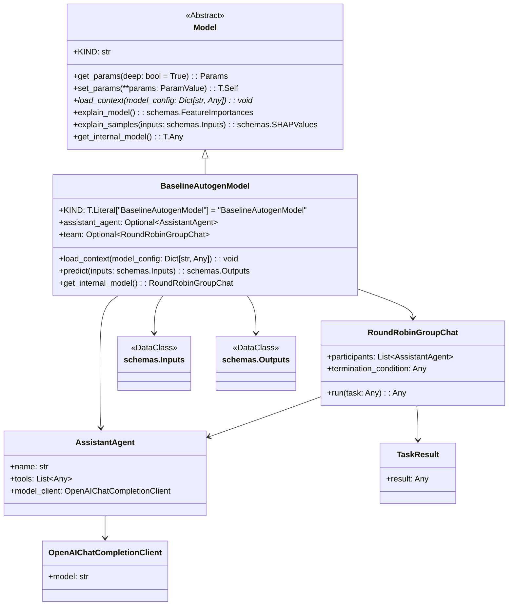

# US [Models](./backlog_mlops_regresion.md) : Define the structure of machine learning models, including architectures and checkpoints, to standardize training and deployment

- [US Models : Define the structure of machine learning models, including architectures and checkpoints, to standardize training and deployment](#us-models--define-the-structure-of-machine-learning-models-including-architectures-and-checkpoints-to-standardize-training-and-deployment)
  - [classes relations](#classes-relations)
  - [**User Story: Develop a Base Model Class for Machine Learning Frameworks**](#user-story-develop-a-base-model-class-for-machine-learning-frameworks)
  - [User Stories: BaselineAutogenModel Class](#user-stories-baselineautogenmodel-class)
    - [**1. User Story: Load Assistant Agent for Predictions**](#1-user-story-load-assistant-agent-for-predictions)
    - [**2. User Story: Predict Outputs Using Inputs**](#2-user-story-predict-outputs-using-inputs)
    - [**Common Acceptance Criteria**](#common-acceptance-criteria)
    - [**Definition of Done (DoD):**](#definition-of-done-dod)
  - [references:](#references)
  - [Code location](#code-location)
  - [Test location](#test-location)

---

## classes relations

https://github.com/microsoft/autogen/blob/main/python/samples/agentchat_chainlit/app.py

## **User Story: Develop a Base Model Class for Machine Learning Frameworks**

---

**Title:**  
As a **machine learning engineer**, I want a **base `Model` class** to standardize the implementation of machine learning models, so that I can easily integrate different frameworks and ensure a consistent interface across the project.

---

**Description:**  
The `Model` class serves as an abstract base class for all machine learning models in the project. It defines a set of essential methods and attributes required for training, predicting, and explaining models. By implementing this base class, users can create custom models that adhere to the project's standards and integrate seamlessly into the pipeline.

---

**Acceptance Criteria:**

1. **Attributes**

   - Define the `KIND` attribute to identify the type of model being implemented.
   - Ensure `KIND` is unique for each subclass of the `Model` class.

2. **Parameter Management**

   - **Get Parameters:**
     - Implement the `get_params` method to retrieve all model parameters.
     - Exclude private (`_`) and uppercase attributes from the parameters list.
   - **Set Parameters:**
     - Implement the `set_params` method to update the model's parameters dynamically.
     - Ensure that parameter updates are applied in place and return the updated model instance.
   - **Load context**: Custom models often require external files such as model weights in order to perform inference. These files, or artifacts, must be handled carefully to avoid unnecessarily loading files into memory or errors during model serialization. When building custom pyfunc models in MLflow, you can use the load_context method to handle model artifacts correctly.

3. **Core Methods**

   - Define the following abstract methods:
     - `fit(inputs: schemas.Inputs, targets: schemas.Targets)`
       - Train the model on provided inputs and targets.
       - Return the fitted model instance.
     - `predict(inputs: schemas.Inputs)`
       - Generate predictions using the trained model.
       - Return outputs in the `schemas.Outputs` format.

4. **Model Explainability**

   - **Global Explainability:**
     - Provide an `explain_model` method to return feature importances.
     - Raise a `NotImplementedError` if not overridden by the subclass.
   - **Local Explainability:**
     - Provide an `explain_samples` method to return SHAP values for individual samples.
     - Raise a `NotImplementedError` if not overridden by the subclass.

5. **Internal Model Access**

   - Implement the `get_internal_model` method to expose the internal model object (e.g., a autogen model).
   - Raise a `NotImplementedError` if the method is not overridden by the subclass.

6. **Validation and Enforcement**

   - Use `pydantic.BaseModel` to enforce strict validation of model attributes and parameters.
   - Set `strict=True`, `frozen=False`, and `extra="forbid"` to ensure data consistency while allowing parameter updates.

7. **Testing**
   - Validate the following scenarios:
     - Successful instantiation of model subclasses.
     - Proper parameter retrieval and updates using `get_params` and `set_params`.
     - Enforcement of abstract method implementation in subclasses.
   - Write unit tests for all methods, ensuring they behave as expected.

---

**Definition of Done (DoD):**

- The `Model` class is implemented with all specified methods and attributes.
- Abstract methods enforce implementation in derived classes.
- Subclass compatibility is verified with unit tests.
- The class is well-documented, including detailed examples of usage.
- The code passes all CI/CD validation checks and integrates seamlessly with existing project modules.

## User Stories: BaselineAutogenModel Class

### **1. User Story: Load Assistant Agent for Predictions**

**Title:**  
As a **data engineer**, I want to load an assistant agent into the baseline model to leverage external tools and AI capabilities for generating responses.

**Description:**  
The `BaselineAutogenModel` class initializes an assistant agent that interacts with external resources (like weather information) to augment its predictions.

**Acceptance Criteria:**  
- The `load_context` method initializes the `assistant_agent` with the correct tools.
- The team setup (e.g., `RoundRobinGroupChat`) is properly configured with the termination conditions.

### **2. User Story: Predict Outputs Using Inputs**

**Title:**  
As a **data scientist**, I want to run predictions based on input data and obtain structured results so that I can analyze and use these outputs in my workflows.

**Description:**  
The `predict` method generates outputs based on a set of inputs, using the initialized assistant team and returning results in a structured format.

**Acceptance Criteria:**  
- The `predict` method processes the provided inputs and streams responses correctly.
- Outputs are formatted into a defined schema including response content and metadata such as timestamps.

### **Common Acceptance Criteria**
1. **Implementation Requirements:**
   - The `BaselineAutogenModel` extends the `Model` class and implements all abstract methods.
   - The `KIND` attribute must be correctly set to `"BaselineAutogenModel"`.

2. **Error Handling:**
   - Both `load_context` and `predict` methods raise informative errors for invalid configurations and inputs.
   - Predict method should handle any potential issues when streaming responses from the team.

3. **Testing:**
   - Unit tests validate the initialization of both the assistant agent and the response outputs.
   - Edge cases are tested, including invalid inputs and behavior of external dependencies.

4. **Documentation:**
   - Comprehensive documentation exists for both `load_context` and `predict` methods.
   - Provide examples of loading the model and executing predictions.

### **Definition of Done (DoD):**
- The `BaselineAutogenModel` class is implemented with fully functional load and predict capabilities.
- All methods in `BaselineAutogenModel` are covered by unit tests.
- Documentation includes thorough explanations and practical examples of model usage.

-
## references:

<https://mlflow.org/blog/autogen-image-agent>
<https://github.com/mlflow/mlflow/tree/master/examples/gateway/mlflow_models>
<https://github.com/mlflow/mlflow/blob/master/examples/gateway/mlflow_models/README.md>

RAG-Chroma

<https://microsoft.github.io/autogen/0.2/docs/notebooks/agentchat_RetrieveChat>

pyfunc mlflow

<https://mlflow.org/blog/custom-pyfunc#:~:text=When%20building%20custom%20pyfunc%20models%20in%20MLflow%2C%20you,containing%20artifacts%20the%20model%20can%20use%20during%20inference>.

## Code location

[src/autogen_team/core/models.py](../src/autogen_team/core/models.py)

## Test location

[tests/core/test_models.py](../tests/core/test_models.py)
