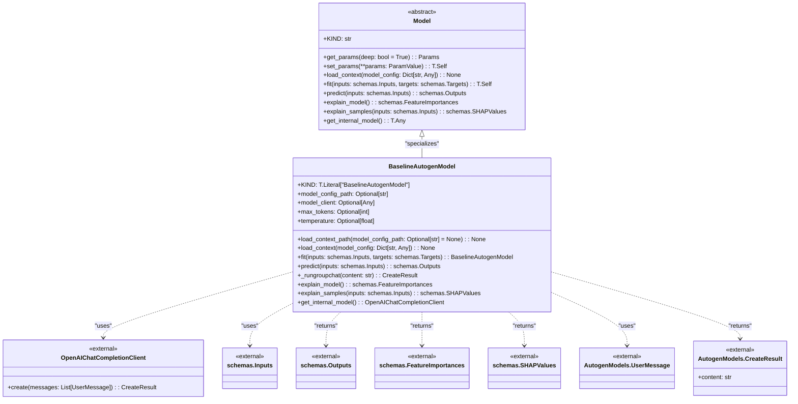

# US [Models](./backlog_llmlops_regresion.md) : Define the structure of machine learning models, including architectures and checkpoints, to standardize training and deployment

- [US Models : Define the structure of machine learning models, including architectures and checkpoints, to standardize training and deployment](#us-models--define-the-structure-of-machine-learning-models-including-architectures-and-checkpoints-to-standardize-training-and-deployment)
  - [classes relations](#classes-relations)
  - [**User Stories: BaselineAutogenModel**](#user-stories-baselineautogenmodel)
    - [**1. User Story: Configure Baseline Autogen Model**](#1-user-story-configure-baseline-autogen-model)
    - [**2. User Story: Load Model Context from a Specified Path**](#2-user-story-load-model-context-from-a-specified-path)
    - [**3. User Story: Load Model Context from a Config Dictionary**](#3-user-story-load-model-context-from-a-config-dictionary)
    - [**4. User Story: Train Model with Input and Target Data**](#4-user-story-train-model-with-input-and-target-data)
    - [**5. User Story: Generate Predictions Using a Group Chat**](#5-user-story-generate-predictions-using-a-group-chat)
    - [**6. User Story: Generate Textual Explanation of Model Structure**](#6-user-story-generate-textual-explanation-of-model-structure)
    - [**7. User Story: Explain Predictions with Input Samples and Dummy SHAP Values**](#7-user-story-explain-predictions-with-input-samples-and-dummy-shap-values)
    - [**8. User Story: Retrieve the Internal Model**](#8-user-story-retrieve-the-internal-model)
    - [**Common Acceptance Criteria**](#common-acceptance-criteria)
    - [**Definition of Done (DoD):**](#definition-of-done-dod)
  - [Code location](#code-location)
  - [Test location](#test-location)

------------

## classes relations

## **User Stories: BaselineAutogenModel**

---

### **1. User Story: Configure Baseline Autogen Model**

**Title:**  
As a **machine learning engineer**, I want to configure the `BaselineAutogenModel` with settings like maximum tokens and temperature, so that I can control the generation of text by the Autogen agent.

**Description:**  
The `BaselineAutogenModel` class allows configuration of parameters such as `max_tokens` and `temperature`, influencing the text generation process of the Autogen agent.

**Acceptance Criteria:**
- The `BaselineAutogenModel` class is configured to work with the Autogen framework.
- The `max_tokens` attribute is configurable with an integer, defining the maximum length of the generated text.
- The `temperature` attribute is configurable with a float, influencing the randomness of the generated text.
- The `KIND` attribute should be set to `"BaselineAutogenModel"` for proper identification.

---

### **2. User Story: Load Model Context from a Specified Path**

**Title:**
As a **machine learning engineer**, I want to load the model configuration from a specified file path, so that I can configure the Autogen client from an external JSON configuration file.

**Description:**
The `load_context_path` method allows loading configuration details, particularly the OpenAI Chat Completion client settings, from a JSON file, thus decoupling settings from the code.

**Acceptance Criteria:**
- The `load_context_path` method loads configuration details from a JSON file specified by the `model_config_path`.
- Raises a `ValueError` if no configuration file path is provided.
- Raises a `FileNotFoundError` if the specified configuration file does not exist.
- Loads a configuration from the specified path and uses it to initialize `OpenAIChatCompletionClient`.

---

### **3. User Story: Load Model Context from a Config Dictionary**

**Title:**
As a **developer**, I want to load the model configuration directly from a dictionary, so that I can programmatically configure the Autogen client with settings.

**Description:**
The `load_context` method allows direct loading of configuration settings from a dictionary, providing a programmatic alternative to loading from a file.

**Acceptance Criteria:**
- The `load_context` method correctly initializes the `OpenAIChatCompletionClient` using the provided configuration dictionary.
- The dictionary includes required keys such as `model`, `temperature`, and `api_base` that are essential to the client setup.
- Raises an exception if the required settings are missing from the dictionary.

---

### **4. User Story: Train Model with Input and Target Data**

**Title:**
As a **machine learning engineer**, I want to have a `fit` method in my Autogen model, so that I can support potential future training or fine-tuning, even if it is not immediately implemented.

**Description:**
The `fit` method, although currently a placeholder, maintains consistency with other model types by including an interface to support future fine-tuning or transfer learning approaches.

**Acceptance Criteria:**
- The `fit` method accepts input and target datasets.
- The `fit` method returns the instance of `BaselineAutogenModel`.
- Although no training occurs, the method provides a point for future implementation.

---

### **5. User Story: Generate Predictions Using a Group Chat**

**Title:**
As an **application developer**, I want to generate responses using a group chat setting in Autogen, so that I can facilitate complex, multi-agent interactions.

**Description:**
The `predict` method generates outputs by engaging the Autogen model in a group chat setting, processing each input and appending the generated responses to the output.

**Acceptance Criteria:**
- The `predict` method iterates through input data and generates responses using Autogen's group chat functionality.
- If the model client is not initialized, a ValueError is raised to prevent incorrect usage.
- Each generated response includes the response content and metadata, such as timestamp and model version.
- The output is a Pandas DataFrame formatted according to the project's schema.

---

### **6. User Story: Generate Textual Explanation of Model Structure**

**Title:**
As a **machine learning engineer**, I want a textual explanation of the model's structure, so that I can understand the model's architecture and processes.

**Description:**
The `explain_model` method provides a high-level, text-based explanation of the model, particularly noting its reliance on the OpenAI Chat API rather than traditional numerical feature importances.

**Acceptance Criteria:**
- The method returns a textual explanation that describes the model's architecture and usage.
- The explanation indicates that the model uses prompt-driven generation and context management instead of numerical feature importances.
- Output should align with the project `FeatureImportances` schema format.

---

### **7. User Story: Explain Predictions with Input Samples and Dummy SHAP Values**

**Title:**
As a **machine learning engineer**, I want to provide explanations for predictions on input samples, so that I can enhance transparency and understanding of the model's decision-making process.

**Description:**
The `explain_samples` method provides explanations for individual predictions by providing textual descriptions alongside dummy SHAP values due to the model's architecture.

**Acceptance Criteria:**
- The method generates explanations for input samples, linking each input to its corresponding model response.
- Textual explanations describe that the model uses prompt-driven generation and context management.
- A dummy SHAP value of 1.0 is assigned to each explanation to maintain a consistent output format.
- The output should follow the project's defined `SHAPValues` schema.

---

### **8. User Story: Retrieve the Internal Model**

**Title:**
As a **developer**, I need to access the internal Autogen model so that I can directly interact with its functionalities, enabling custom behaviors or advanced configurations.

**Description:**
The `get_internal_model` method exposes the underlying OpenAIChatCompletionClient, allowing direct interaction with the Autogen framework.

**Acceptance Criteria:**
- The method returns an instance of the `OpenAIChatCompletionClient`.
- A `ValueError` is raised if the model client is not initialized or is of the incorrect type.

---

### **Common Acceptance Criteria**

1. **Implementation Requirements:**
   - The `BaselineAutogenModel` class correctly implements the abstract methods from the base `Model` class.
   - All configurations and initializations are handled properly within the methods.

2. **Error Handling:**
   - Specific exceptions are raised when configurations are missing or incorrect, guiding users in debugging issues.

3. **Testing:**
   - Unit tests validate the configuration, loading, prediction generation, and explanation aspects of the model.
   - Tests ensure proper interactions with the Autogen framework, as well as accurate adherence to project-defined schemas.

4. **Documentation:**
   - Each method includes comprehensive docstrings explaining its purpose, parameters, and outputs.
   - Examples are provided to demonstrate the model's usage and integration with various tools and frameworks.

---

### **Definition of Done (DoD):**

- The `BaselineAutogenModel` class is fully implemented and tested.
- All user stories are reflected in the code, and the acceptance criteria are met.
- The documentation is thorough and provides clear guidance for all users.
- Code adheres to project standards and passes all CI/CD checks.

## Code location

[src/autogen_team/core/models.py](../src/autogen_team/core/models.py)

## Test location

[tests/core/test_models.py](../tests/core/test_models.py)