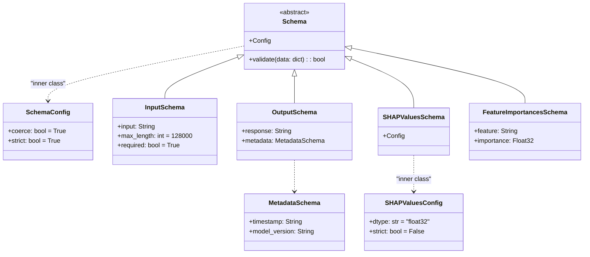

# US [Scchemas](./backlog_llmops_autogen.md) : Define structured data formats for input, output, and intermediate processes, ensuring consistency and validation throughout the pipeline

- [US Scchemas : Define structured data formats for input, output, and intermediate processes, ensuring consistency and validation throughout the pipeline](#us-scchemas--define-structured-data-formats-for-input-output-and-intermediate-processes-ensuring-consistency-and-validation-throughout-the-pipeline)
  - [classes relations](#classes-relations)
  - [**User Story: Validate Large String Inputs and JSON Outputs for Autogen Pipelines**](#user-story-validate-large-string-inputs-and-json-outputs-for-autogen-pipelines)
  - [**User Story: Extend Metadata for Tracking and Debugging**](#user-story-extend-metadata-for-tracking-and-debugging)
  - [Code location](#code-location)
  - [Test location](#test-location)

------------

## classes relations

## **User Story: Validate Large String Inputs and JSON Outputs for Autogen Pipelines**

---

**Title:**  
As a **developer**, I want to validate large string inputs and structured JSON outputs, so that I can ensure the integrity and consistency of data processed in autogen pipelines.

---

**Description:**  
This implementation defines a schema for handling large text inputs (up to 128,000 tokens) and generating structured JSON responses. The schema ensures input validation and enforces a consistent format for outputs, enabling reliable integration into downstream processes and facilitating scalability.

---

**Acceptance Criteria:**  

1. **Input Schema:**  
   - Accepts a single string as input.  
   - **Constraints:**  
     - Maximum length of 128,000 tokens.  
     - The input string is required and cannot be empty.  

2. **Output Schema:**  
   - Defines a structured JSON format for outputs.  
   - **Required Properties:**  
     - `response`: A string containing the generated output, capped at 128,000 tokens.  
   - **Optional Properties:**  
     - `metadata`: An object providing additional information about the output.  
       - Includes `timestamp` (ISO 8601 format) and `model_version` (string) as optional fields.  

3. **Validation Rules:**  
   - Input validation:  
     - Reject inputs that exceed the maximum token limit or are not strings.  
   - Output validation:  
     - Ensure the `response` field is always present and valid.  
     - Verify optional `metadata` fields when included.  

4. **Error Handling:**  
   - For invalid inputs, raise descriptive errors indicating the specific violation (e.g., "Input exceeds 128,000 tokens").  
   - For invalid outputs, log and flag inconsistencies for debugging.

5. **Testing:**  
   - Create unit tests to verify:  
     - Inputs are correctly validated against schema constraints.  
     - Outputs conform to the required JSON structure, including valid `response` and optional `metadata`.  
     - Error handling for invalid inputs and outputs works as expected.  

6. **Documentation:**  
   - Provide clear examples of:  
     - Valid input strings and how they are processed.  
     - Expected JSON output structure.  
   - Include details on validation errors and how to handle them.  

---

**Definition of Done (DoD):**  

- The input and output schemas are implemented and validated.  
- Unit tests for input and output validation pass successfully.  
- Errors for invalid inputs/outputs are descriptive and actionable.  
- Documentation is complete with usage examples, validation rules, and error handling details.  
- The schema is integrated into the autogen pipeline, ensuring consistent input and output handling.

---

## **User Story: Extend Metadata for Tracking and Debugging**

---

**Title:**  
As a **data scientist**, I want to extend the metadata in the JSON output schema, so that I can track model versions and processing timestamps for debugging and analysis.

---

**Description:**  
The metadata section of the output schema provides optional fields to track additional information, such as the time of response generation and the model version used. This facilitates debugging, auditability, and better insights into the processing pipeline.

---

**Acceptance Criteria:**  

1. **Metadata Fields:**  
   - `timestamp`: ISO 8601 date-time string representing when the output was generated.  
   - `model_version`: String identifying the version of the model used for processing.  

2. **Extensibility:**  
   - Ensure new fields can be added to `metadata` without breaking existing functionality.  

3. **Validation Rules:**  
   - Verify that `timestamp` is in the correct format when present.  
   - Ensure `model_version` is a valid string if included.  

4. **Testing:**  
   - Validate outputs with and without `metadata`.  
   - Verify incorrect `timestamp` formats or invalid `model_version` strings raise appropriate errors.  

5. **Documentation:**  
   - Provide examples of outputs with and without `metadata`.  
   - Include descriptions of how to use metadata for tracking and debugging.  

---

**Definition of Done (DoD):**  

- Metadata fields are implemented and validated.  
- Tests for metadata validation pass successfully.  
- Documentation includes examples and usage scenarios.  
- Metadata is integrated into the output schema for tracking and debugging purposes.

---

Let me know if you need further refinements!  

## Code location

[src/autogen_team/core/schemas.py](../src/autogen_team/core/schemas.py)

## Test location

[tests/core/test_schemas.py](../tests/core/test_schemas.py)
